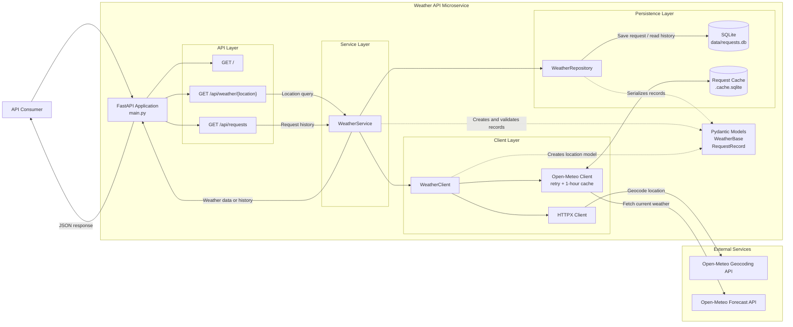

# weather-api
### Simple weather API that allows for locational querying and request history

## About
weather-api is designed as a lightweight FastAPI microservice that utilizes an external API to retrieve weather data for a given location and store request history.



## Installation

### Prerequisites

* Python 3.12
* pip

### Setup

1. **Clone repository:**
    ```bash
    git clone https://github.com/mateoroman1/weather-api.git
    cd weahter-api
    ```

2. **Set up virtual environment**
    ```bash
    python -m venv venv
    ```
   * On **macOS/Linux**:
     ```bash
     source venv/bin/activate
     ```
   * On **Windows** (Command Prompt):
     ```cmd
     venv\Scripts\activate
     ```
   * On **Windows** (PowerShell):
     ```powershell
     .\venv\Scripts\Activate.ps1
     ```

4. **Install dependencies:**
   ```bash
   pip install --upgrade pip
   pip install -r requirements.txt
   ```

## Usage

Run the application
```bash
uvicorn main:app --reload
```

### OpenAPI docs

FastAPI autogenerated docs can be viewed at
```
http://127.0.0.1:8000/docs
```
## Project Design
### Framework
Keeping scaling and project scope in mind, FastAPI was the ideal choice for this project. Flask is synchronous and requires more manual setup, and while Django does have a REST framework, it's typically better suited for monolithic applications, making it overkill for a small microservice like this.

### Data store
My goal was to implement a repository pattern, which would separate the application logic from the persistence layer and allow for easier testing. 

The persistence layer uses a sqlite database with a single **weather_requests** table. This was a decision made for brevity's sake. With proper repository abstraction, this matters less and in the future could easily be migrated to something like Postgres with minimal refactoring.

### External API
I wanted to avoid requiring clients to know the latitude and longitude of the location they were requesting data for. The majority of free weather API services unfortunately are built around that, which meant I needed to find a way to geocode a location name into latitude and longitude.

Thankfully, OpenMeteo has a public Geocode API that allows for that! They also have a python library for requests to the actual weather API.
This came with some limitations that I am not exactly enthusiastic about but they present an interesting challenge to address.

- openmeteo_requests does NOT return a response code. If the service returns an error code, the library parses it and returns a generic exception. In the future, I would just implement the weather client fully with httpx. The benefit of that would be our external API client can be vender-agnostic

- The library also does not have the geocode api, meaning I ended up using httpx anyways, so there really was no point to using the library other than it saved me some time.

### Possible future steps

* Containerization with Docker
* Fully implement repository pattern
* Logging and error handling
* Postgres migration

